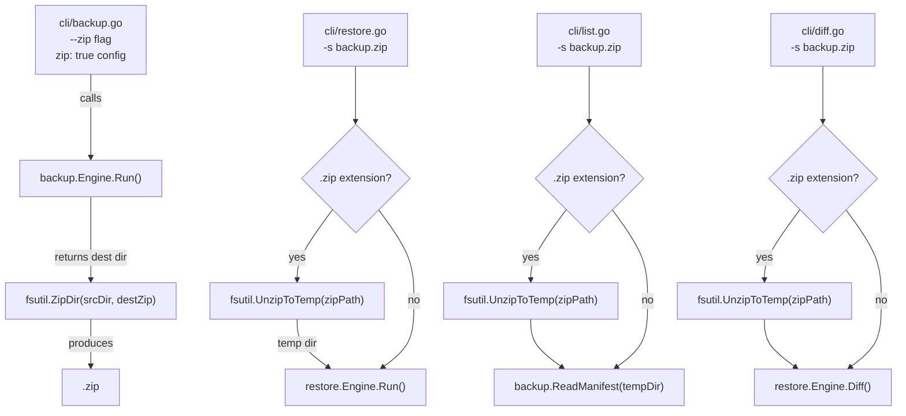

# System Design & Architecture

## Architecture Overview



### Key components

| Component | Responsibility |
|-----------|---------------|
| `internal/fsutil/zip.go` | `ZipDir` and `UnzipToTemp` utility functions |
| `internal/cli/backup.go` | `--zip` / `--zip-only` flags; call `ZipDir` after `Engine.Run` |
| `internal/cli/restore.go` | Detect `.zip` source; call `UnzipToTemp`; pass temp dir to engine |
| `internal/cli/list.go` | Same zip-detection as restore |
| `internal/cli/diff.go` | Same zip-detection as restore |
| `internal/config/config.go` | Add `zip: bool` and `zip_only: bool` to top-level config |
| `internal/backup/engine.go` | Call `cleanOldBackups` extended to also remove `.zip` companions |

## Data Models

### Config additions

```go
// Config (top-level)
type Config struct {
    // existing fields …
    Zip     bool `yaml:"zip"`      // produce .zip after every backup (default false)
    ZipOnly bool `yaml:"zip_only"` // remove uncompressed dir after zipping (default false)
}
```

### Zip archive structure (flat, mirrors backup dir)

```
<backup_dest>.zip
├── manifest.yaml
├── ssh/
│   ├── config
│   └── id_rsa.age
├── browser/
│   └── GoogleChrome/
│       └── Default/
│           └── Bookmarks
└── projects/
    └── myproject/
        └── main.go
```

No wrapping folder inside the zip — paths start directly at the category level, matching the
existing `manifest.yaml` `path` values.

## API Design (internal interfaces)

```go
// internal/fsutil/zip.go

// ZipDir creates a zip archive at destZip containing all files under srcDir.
// File paths inside the zip are relative to srcDir.
func ZipDir(srcDir, destZip string) error

// UnzipToTemp extracts zipPath into a new temporary directory.
// Returns the temp dir path and a cleanup function that removes it.
// Caller must call cleanup() when done (typically deferred).
func UnzipToTemp(zipPath string) (dir string, cleanup func(), err error)
```

```go
// internal/cli shared helper

// resolveBackupSource returns the effective backup directory to use.
// If src ends with ".zip", it extracts to a temp dir and returns (tempDir, cleanup, nil).
// Otherwise it returns (src, noop, nil).
func resolveBackupSource(src string) (dir string, cleanup func(), err error)
```

## Component Breakdown

### `internal/fsutil/zip.go` (new file)

- `ZipDir`: walks `srcDir` with `filepath.WalkDir`, creates zip writer, writes each file preserving relative paths. Skips symlinks.
- `UnzipToTemp`: creates `os.MkdirTemp`, iterates zip entries, recreates directory structure, extracts files. Guards against path-traversal (`zip slip` attack: reject entries with `..`).

### `internal/cli/backup.go` changes

```go
// New flags
var zipFlag     bool  // --zip
var zipOnlyFlag bool  // --zip-only

// After engine.Run() succeeds:
if zipFlag || cfg.Zip {
    destZip := dest + ".zip"
    if err := fsutil.ZipDir(dest, destZip); err != nil {
        log.Warn("zipping backup: %v", err)
    } else {
        log.Info("Compressed backup: %s", fsutil.ContractPath(destZip))
        if zipOnlyFlag || cfg.ZipOnly {
            _ = os.RemoveAll(dest)
        }
    }
}
```

### `internal/cli/restore.go` (and list.go, diff.go) changes

```go
dir, cleanup, err := resolveBackupSource(sourceFlag)
if err != nil { … }
defer cleanup()
// use dir instead of sourceFlag for manifest reading and engine.Run
```

### `internal/backup/engine.go` — rotation cleanup

Extend `cleanOldBackups` to also remove `<rotatedDir>.zip` when cleaning up old rotated backups.

## Design Decisions

| Decision | Choice | Rationale |
|----------|--------|-----------|
| Archive format | `.zip` | Native macOS support (double-click); Go stdlib; cross-platform |
| Zip structure | Flat (no wrapper dir) | Matches existing manifest paths; no path remapping needed on restore |
| Keep uncompressed dir | Yes (default) | Required for next incremental backup run |
| Zip-only mode | `--zip-only` flag | Power users who don't need incremental can save space |
| Zip slip protection | Reject `..` in paths | Security requirement for archive extraction |
| Compress level | `flate.DefaultCompression` | Balance speed vs size; most files are already small/binary |

## Non-Functional Requirements

- **Performance**: `ZipDir` should stream files (no full in-memory buffer). A 500 MB backup should
  complete in < 30 s on typical hardware.
- **Safety**: `UnzipToTemp` must reject zip-slip paths (`../` traversal).
- **Atomicity**: zip is written to a temp file then renamed to prevent partial archives.
- **Idempotency**: Running `--zip` twice does not corrupt the archive (overwrites cleanly).
