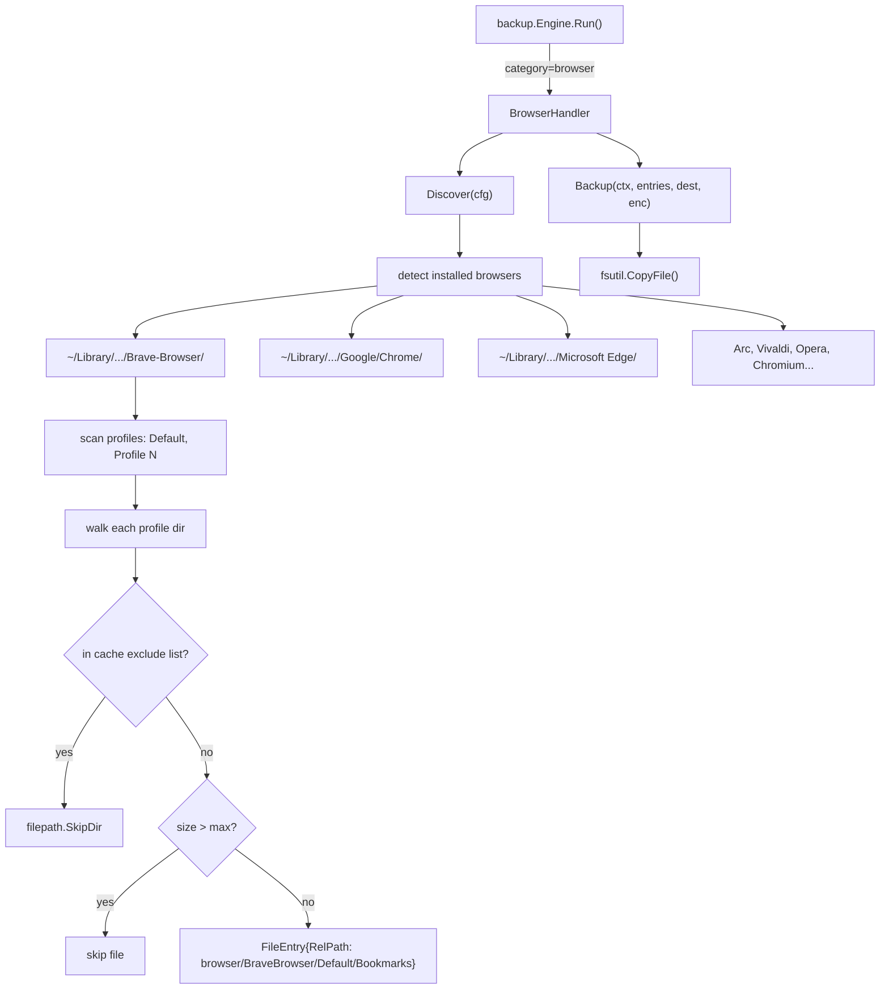

# Chrome Profile Backup - System Design

## Architecture Overview

The `browser` category slots into the existing `Category` interface. One new handler (`BrowserHandler`), one new config field (`Browsers []BrowserConfig`), and updates to config validation and default config.



## Data Models

### New config shape — `browsers` field under `CategoryConfig`

The `browser` category reuses the existing `CategoryConfig`. Key fields used:
- `Exclude []string` — additional per-entry excludes (on top of built-in cache list)
- `MaxFileSizeMB int` — skip files above this size (default 50)
- `ScanDirs []string` — **override** browser root dirs (optional; auto-detection used when empty)

New sub-struct (added to `config` package):

```go
// No new struct needed — BrowserHandler hard-codes the known browser paths
// and uses CategoryConfig.Exclude for user overrides.
```

### YAML config shape

```yaml
browser:
  enabled: true
  max_file_size_mb: 50
  exclude:
    # Built-in cache dirs are always excluded; add extras here
    - History          # optional: exclude browsing history for privacy
    - "Login Data*"    # optional: exclude saved passwords
```

### `FileEntry.RelPath` format

```
browser/<SafeBrowserName>/<ProfileName>/<file-relative-to-profile>
```

Examples:
```
browser/BraveBrowser/Default/Bookmarks
browser/BraveBrowser/Default/Preferences
browser/BraveBrowser/Default/Extensions/cjpalhdlnbpafiamejdnhcphjbkeiagm/3.5.0_0/manifest.json
browser/GoogleChrome/Profile 1/Bookmarks
```

`<SafeBrowserName>` is the filesystem-safe name derived from the browser's vendor dir name (spaces → underscores are not needed as Go filepath handles them).

## Component Breakdown

### New file: `internal/backup/browser.go`

```
BrowserHandler
  Name() string                                    → "browser"
  Discover(cfg *config.CategoryConfig) []FileEntry → detect + walk all profiles
  Backup(ctx, entries, dest, enc) *CategoryResult  → CopyFile per entry (same as dotfiles)

knownBrowsers() []browserDef                       → returns list of {name, appSupportPath}
discoverProfiles(browserDir string) []string       → returns profile subdirs
discoverBrowserFiles(browserName, profileDir string, cfg) []FileEntry
isBuiltinCacheDir(name string) bool                → true for Cache, Code Cache, etc.
```

### Known browsers list (hard-coded, extensible via ScanDirs)

| Browser | macOS path under `~/Library/Application Support/` |
|---------|--------------------------------------------------|
| Brave | `BraveSoftware/Brave-Browser` |
| Google Chrome | `Google/Chrome` |
| Chromium | `Chromium` |
| Microsoft Edge | `Microsoft Edge` |
| Arc | `Arc/User Data` |
| Vivaldi | `Vivaldi` |
| Opera | `com.operasoftware.Opera` |
| Opera GX | `com.operasoftware.OperaGX` |

### Built-in cache exclusion list (always excluded, not configurable off)

```
Cache, Code Cache, GPUCache, DawnCache, DawnGraphiteCache, GraphiteDawnCache,
GrShaderCache, CacheStorage, ScriptCache, PnaclTranslationCache, ShaderCache,
BrowserMetrics*, Crashpad, CrashpadMetrics*, GrShaderCache
```

### Changes to existing files

| File | Change |
|------|--------|
| `internal/config/config.go` | Add `"browser"` to `validCategories` |
| `internal/config/defaults.go` | Add default `browser` entry (enabled, max 50 MB) |
| `internal/backup/browser.go` | **New file** |

## Design Decisions

### Decision 1: Hard-code known browser paths, allow ScanDirs override
- **Choice**: Hard-coded list of ~8 browsers; `ScanDirs` used for custom paths
- **Rationale**: 95% of users have one of the known browsers; no discovery magic needed
- **Alternative rejected**: Glob `~/Library/Application Support/*/Default/Bookmarks` — too broad, matches non-browsers

### Decision 2: Category name is `"browser"` (not `"chrome"`)
- **Choice**: `browser` — covers all Chromium-based browsers
- **Rationale**: User may have Brave, Edge, Arc — naming it `chrome` would be misleading

### Decision 3: Do NOT mark Login Data / Cookies as secrets
- **Choice**: Back up as plain files (no age encryption)
- **Rationale**: These files are already encrypted by macOS Keychain at the OS level. The encrypted blobs are only useful on the same machine with the same macOS user. Adding age encryption would corrupt them. Document this clearly.

### Decision 4: Profile discovery via dir name pattern
- **Choice**: Any top-level dir in the browser data root named `Default`, matching `Profile *`, or `Guest Profile`
- **Rationale**: This is the Chromium convention; robust across all Chromium forks
- **Alternative rejected**: Parse `Local State` JSON for profile list — adds JSON parsing complexity

### Decision 5: RelPath includes browser name + profile name
- **Choice**: `browser/<BrowserName>/<ProfileName>/...`
- **Rationale**: Enables restore to the correct browser and profile path; allows multi-browser backup in one dest

## Non-Functional Requirements

- **Size**: Cache exclusion is critical. Without it, a single Brave profile can be 2–5 GB. With exclusion, typically 50–500 MB.
- **Performance**: `filepath.WalkDir` with early `SkipDir` on cache dirs keeps it fast.
- **Safety**: Browser should be quit before restore. macback warns but does not enforce this.
- **Correctness**: `RelPath` must reconstruct to exact `~/Library/Application Support/<path>/<profile>/<file>` for restore.
