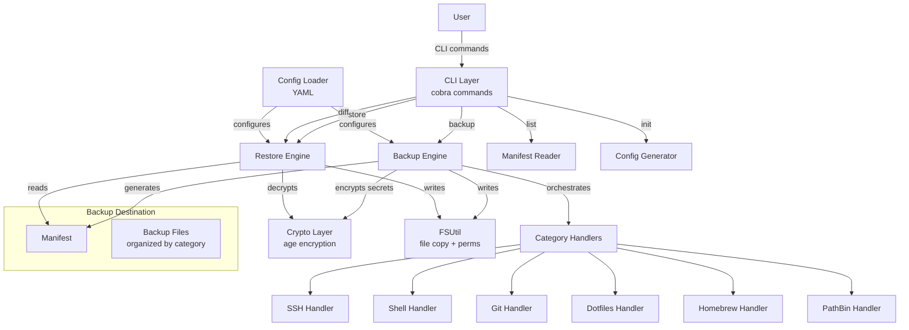

# Config Backup & Restore - System Design

## Architecture Overview
**High-level system structure**



### Key Components
| Component | Responsibility |
|-----------|---------------|
| CLI Layer | Parse commands/flags, delegate to engines |
| Config Loader | Load and validate `~/.macback.yaml` |
| Backup Engine | Orchestrate backup across categories, generate manifest |
| Restore Engine | Read manifest, restore files with safety checks |
| Category Handlers | Category-specific backup/restore logic (6 handlers) |
| Crypto Layer | age passphrase encryption/decryption, secret detection |
| FSUtil | File copy with permission preservation, hashing |
| Manifest | YAML file tracking all backed-up files with metadata |

### Technology Stack
| Choice | Rationale |
|--------|-----------|
| Go | Single binary, no runtime deps, fast, good CLI ecosystem |
| cobra | Industry-standard Go CLI framework |
| filippo.io/age | Go-native age encryption, no external binary |
| gopkg.in/yaml.v3 | Mature YAML library for config and manifest |
| golang.org/x/term | Secure passphrase input without echo |

## Data Models
**Core entities and structures**

### Config (`~/.macback.yaml`)
```yaml
backup_dest: ~/macback-backups
categories:
  ssh:
    enabled: true
    paths: ["~/.ssh/config", "~/.ssh/known_hosts", "~/.ssh/id_*", "~/.ssh/*.pub"]
    secret_patterns: ["id_*", "!*.pub"]
    exclude: ["*.sock", "agent.*"]
  shell:
    enabled: true
    paths: ["~/.zshrc", "~/.zprofile", "~/.zshenv", "~/.bashrc", "~/.bash_profile", "~/.profile", "~/.aliases", "~/.functions"]
  git:
    enabled: true
    paths: ["~/.gitconfig", "~/.gitignore_global", "~/.git-credentials"]
    secret_patterns: [".git-credentials"]
  dotfiles:
    enabled: true
    paths: ["~/.config/", "~/bin/", "~/scripts/", "~/.vimrc", "~/.tmux.conf"]
    exclude: ["*.log", "Cache/", "CachedData/", "GPUCache/", "node_modules/"]
    secret_patterns: [".env", ".env.*", "*secret*", "*credential*"]
  homebrew:
    enabled: true
    include_casks: true
    include_taps: true
  pathbin:
    enabled: true
    scan_dirs: ["/usr/local/bin", "~/bin", "~/go/bin", "~/.local/bin"]
    catalog_only: true
encryption:
  enabled: true
  global_secret_patterns: ["*.pem", "*.key", "*.p12", ".env", ".env.*"]
  extension: ".age"
```

### Manifest (`manifest.yaml`)
```yaml
version: 1
created_at: "2026-02-23T14:30:00Z"
hostname: "MyMacBook.local"
username: "user"
macos_version: "15.5"
macback_version: "0.1.0"
categories:
  ssh:
    backed_up: true
    file_count: 5
    encrypted_count: 2
    files:
      - path: "ssh/config"
        original: "~/.ssh/config"
        size: 1234
        mode: "0644"
        mod_time: "2026-02-20T10:00:00Z"
        sha256: "abc..."
        encrypted: false
```

### PATH Binary Catalog (`pathbin/catalog.yaml`)
```yaml
scanned_at: "2026-02-23T14:30:00Z"
directories:
  - path: /usr/local/bin
    binaries:
      - name: "my-tool"
        size: 45678
        mode: "0755"
        is_symlink: true
        symlink_target: "/usr/local/Cellar/my-tool/1.0/bin/my-tool"
        source: "homebrew"  # Detected: homebrew, go, cargo, npm, manual
```

## API Design
**CLI Command Interface**

```
macback init [--output path] [--force]
macback backup [--config path] [--dest path] [--categories cat1,cat2] [--dry-run] [--passphrase-file path] [-v]
macback restore --source path [--config path] [--categories cat1,cat2] [--force] [--dry-run] [--passphrase-file path] [-v]
macback diff --source path [--categories cat1,cat2]
macback list --source path [--categories cat1,cat2] [--show-secrets]
macback version
```

### Persistent Flags (all commands)
- `--config, -c` - Config file path (default: `~/.macback.yaml`)
- `--verbose, -v` - Verbose output

### Categories (valid values)
`ssh`, `shell`, `git`, `dotfiles`, `homebrew`, `pathbin`

## Component Breakdown

### Package Structure
```
cmd/macback/main.go           # Entry point
internal/
  cli/                        # Cobra command definitions
    root.go, backup.go, restore.go, diff.go, list.go, init.go, version.go
  config/                     # YAML config types and loading
    config.go, defaults.go
  backup/                     # Backup engine + category handlers
    engine.go, category.go, manifest.go
    ssh.go, shell.go, git.go, dotfiles.go, homebrew.go, pathbin.go
  restore/                    # Restore engine + diff + safety
    engine.go, diff.go, safety.go
  crypto/                     # age encryption + secret detection
    age.go, detect.go
  fsutil/                     # File utilities
    copy.go, permissions.go, homedir.go
```

### Key Interfaces

```go
// Category - each backup type implements this
type Category interface {
    Name() string
    Discover(cfg *config.CategoryConfig) ([]FileEntry, error)
    Backup(ctx context.Context, entries []FileEntry, dest string, enc crypto.Encryptor) (*CategoryResult, error)
    Restore(ctx context.Context, entries []ManifestEntry, source string, dec crypto.Decryptor) error
}

// Encryptor / Decryptor - age wrappers
type Encryptor interface {
    EncryptFile(srcPath, dstPath string) (string, error)
}
type Decryptor interface {
    DecryptFile(srcPath, dstPath string) error
}
```

## Design Decisions

| Decision | Rationale | Alternatives Considered |
|----------|-----------|------------------------|
| Go single binary | No runtime deps, easy to install/distribute | Python (needs runtime), shell scripts (limited) |
| Category interface pattern | Uniform lifecycle for diverse backup types, easy to extend | Switch statements (harder to maintain) |
| age passphrase (scrypt) | Simple UX, no key management | GPG (complex setup), macOS Keychain (not portable) |
| YAML config | Human-readable, widely known | TOML (less common), JSON (no comments) |
| Manifest per backup | Enables integrity verification, tracks permissions | No manifest (lossy, can't verify) |
| `catalog_only` for PATH | Most binaries should reinstall via package manager | Copy all binaries (bloated, version mismatch risk) |
| `internal/` package | Prevents external imports, all public API is CLI | `pkg/` (unnecessary for CLI tool) |

## Non-Functional Requirements

### Performance
- Backup should complete in < 30 seconds for typical configs
- No unnecessary file reads (skip identical files based on mod time + size)

### Security
- SSH private keys and credentials always encrypted with age
- Passphrase never written to disk, only held in memory during command execution
- No symlinks followed during restore (prevent symlink attacks)
- File permissions preserved exactly as original

### Reliability
- Partial failures don't abort entire backup (non-fatal warnings per file)
- Manifest integrity check before restore (SHA256 verification)
- Conflict resolution on restore (prompt, diff, skip, force)
