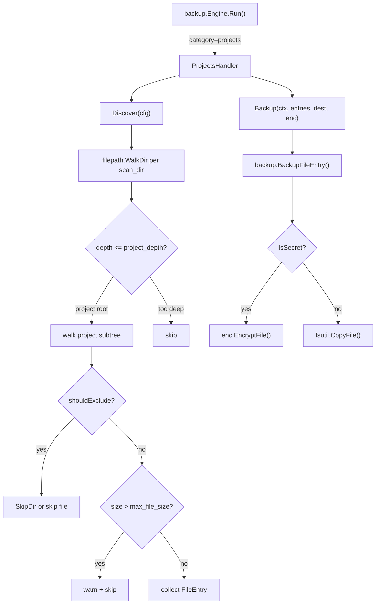

# Project Backup - System Design

## Architecture Overview

The `projects` category slots into the existing `Category` interface with no changes to the backup engine. It adds one new handler (`ProjectsHandler`), one new config field (`MaxFileSizeMB`), and updates the category validator and default config.



## Data Models

### New `CategoryConfig` field

```go
// CategoryConfig (existing, in internal/config/config.go)
type CategoryConfig struct {
    // ... existing fields ...
    MaxFileSizeMB  int      `yaml:"max_file_size_mb,omitempty"`  // NEW: skip files larger than this (0 = no limit)
    ProjectDepth   int      `yaml:"project_depth,omitempty"`     // NEW: depth of project roots under scan_dirs (default: 1)
}
```

### `FileEntry` (no changes needed)

Existing `FileEntry` struct is sufficient. `RelPath` will be relative to the project root dir for restore fidelity.

### Config YAML shape (new `projects` section)

```yaml
projects:
  enabled: false          # disabled until user configures scan_dirs
  scan_dirs:
    - ~/Works
    - ~/projects
  project_depth: 1        # ~/Works/projectA is a project root
  max_file_size_mb: 50    # skip files > 50 MB
  exclude:
    # --- Package managers ---
    - node_modules
    - vendor
    - .venv
    - venv
    - env
    - Pods
    # --- Build outputs ---
    - __pycache__
    - .gradle
    - build
    - target
    - dist
    - .next
    - .nuxt
    - out
    # --- Caches & tooling ---
    - .cache
    - .git
    - .DS_Store
    - "*.pyc"
    - "*.class"
  secret_patterns:
    - .env
    - .env.*
    - "*secret*"
    - "*.pem"
    - "*.key"
```

## Component Breakdown

### New file: `internal/backup/projects.go`

```
ProjectsHandler
  Name() string                                         → "projects"
  Discover(cfg *config.CategoryConfig) []FileEntry      → walk scan_dirs, apply depth + excludes + size filter
  Backup(ctx, entries, dest, enc) *CategoryResult       → delegate to BackupFileEntry() per entry
```

Helper functions (within `projects.go`):
- `discoverProject(scanDir, projectDir string, cfg *config.CategoryConfig) []FileEntry` — walk one project root
- `isExcludedProject(name string, excludes []string) bool` — match dir/file name against exclude list (reuses `shouldExcludeEntry` from dotfiles.go or extracted to shared helper)
- `maxBytes(cfg *config.CategoryConfig) int64` — return `MaxFileSizeMB * 1024 * 1024`, 0 means unlimited

### Changes to existing files

| File | Change |
|------|--------|
| `internal/config/config.go` | Add `MaxFileSizeMB int` and `ProjectDepth int` to `CategoryConfig`; add `"projects"` to `validCategories` |
| `internal/config/defaults.go` | Add default `projects` entry (disabled, with full default exclude list) |
| `internal/backup/projects.go` | **New file** — `ProjectsHandler` implementation |

## Design Decisions

### Decision 1: `RelPath` relative to scan_dir (not project root)
- **Choice**: `RelPath = <projectName>/<file>` (relative to `scan_dir`)
- **Rationale**: Preserves project directory structure in backup. Restore can recreate the full tree under `scan_dir`.
- **Alternative rejected**: Relative to project root only — loses project name in backup path.

### Decision 2: `project_depth` for project root detection
- **Choice**: Configurable `project_depth` (default 1 = direct children of `scan_dir` are projects)
- **Rationale**: Handles monorepos (`~/Works/company/repo` at depth 2) and flat layouts (`~/projects/repo` at depth 1).
- **Alternative rejected**: Auto-detect git repos — adds complexity, misses non-git projects.

### Decision 3: Per-category `max_file_size_mb` on `CategoryConfig`
- **Choice**: Add `MaxFileSizeMB` to existing `CategoryConfig` struct
- **Rationale**: Useful for other categories too (e.g., appsettings), minimal schema change.
- **Alternative rejected**: Global-only limit — too inflexible.

### Decision 4: Default disabled with no scan_dirs
- **Choice**: `enabled: false` in default config
- **Rationale**: Without configured scan_dirs the handler has nothing to do; enabling by default would be a no-op and confusing.

### Decision 5: `shouldExcludeEntry` reuse
- **Choice**: Extract `shouldExcludeEntry` from `dotfiles.go` to a shared `exclude.go` in the backup package, or call it directly (it's package-internal).
- **Rationale**: Avoid code duplication; the function already handles glob patterns at any path depth.

## Non-Functional Requirements

- **Performance**: WalkDir is O(files). For large projects, the size filter and early `SkipDir` on excluded dirs keep this fast. Exclude check is O(patterns × depth) — acceptable for typical pattern counts (<20).
- **Safety**: Symlinks skipped (consistent with rest of macback). No follow-symlink traversal.
- **Correctness**: Relative path construction uses `filepath.Rel(scanDir, filePath)` to ensure OS-correct separators.
- **Observability**: Warnings emitted for: scan_dir not found, files skipped due to size limit, individual file copy errors.
